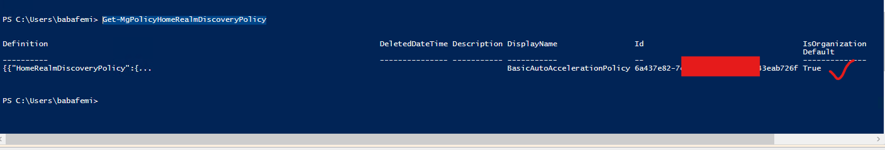
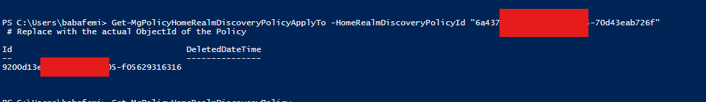
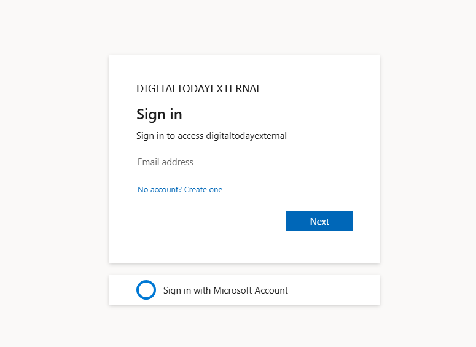
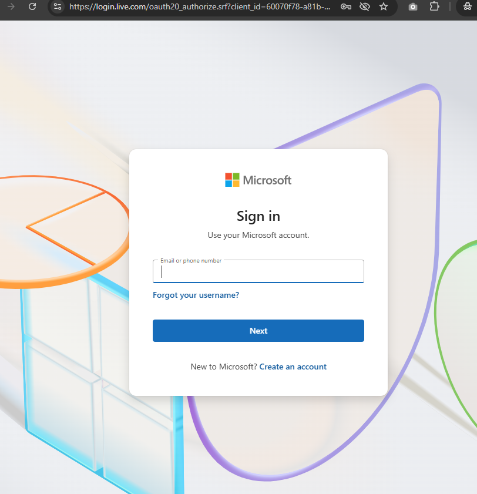
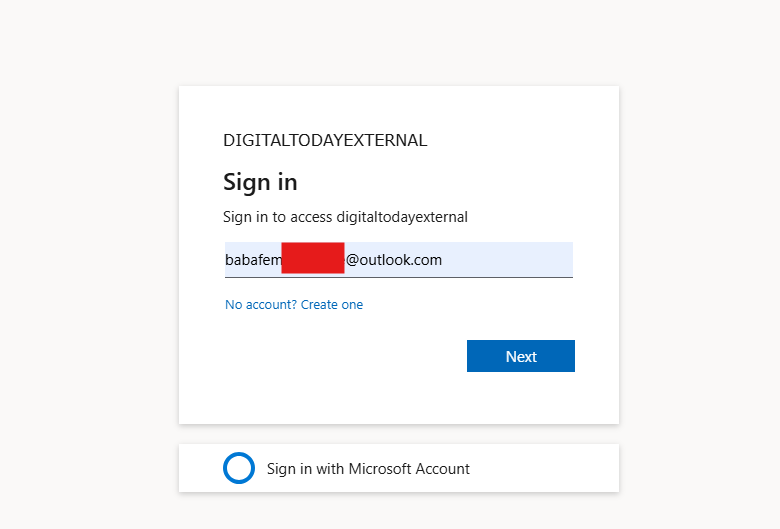
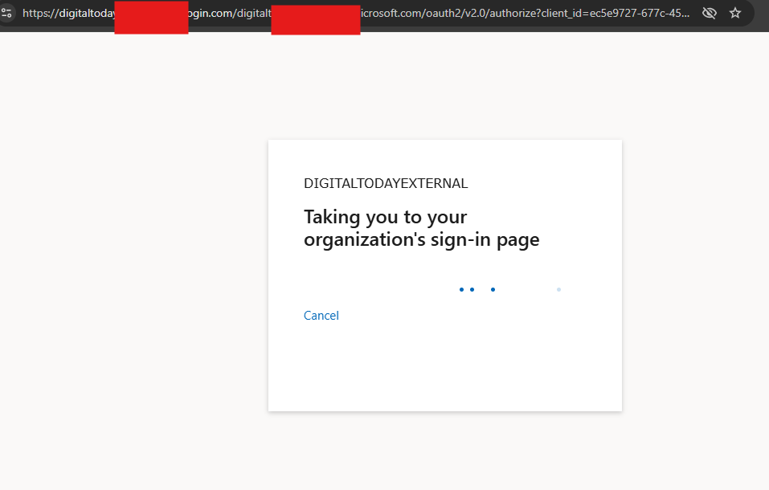

# Microsoft Entra ID External IDP with Microsoft Account (MSA)

This repository documents how Microsoft Account (MSA) functions as an external identity provider in an Entra ID tenant — with emphasis on **how Home Realm Discovery (HRD)** works in this scenario.

---

## Concept

When a user signs in using a **Microsoft Account** (e.g., Outlook.com) via "Sign in with Microsoft", Entra ID leverages **Home Realm Discovery (HRD)** to automatically redirect future login attempts to the correct identity provider.
The screenshot below shows that HRD is configured to fucntion within the Organization

This can also be assigned to specific application if you dont want it to be Organization based

---

## User Authentication Flow

### 1. First-Time Sign-In

- User clicks **Sign in with Microsoft** on a web app.
- Redirected to Microsoft Identity Platform (MSA).
- On successful sign-in, a user account is created in the Entra tenant.

Screenshots: HRD-based automatic redirection

---

### 2. Return Visits — HRD in Action

- User accesses the app directly via its URL (no button click).
- Entra ID **automatically detects** the domain (`@outlook.com`) using HRD.
- Redirects the user straight to MSA login without any manual selection.

Screenshots: HRD-based automatic redirection

---

## What This Proves

✅ **Home Realm Discovery (HRD)** is functional and routing correctly based on the email domain.  
✅ Users no longer need to choose their identity provider manually.  
✅ Microsoft Account federation is working within an External Entra ID tenant.

---

## Repository Contents

| File/Folder | Description |
|-------------|-------------|
| `README.md` | This high-level overview of the login flow |
| `images/`   | Screenshots of the IDP setup, HRD flow, and user experience |

---

## Notes

- This repo does **not** cover setup steps — it's meant to demonstrate the **behavior** and **outcomes** of a successful Entra ID + MSA integration.
- Screenshots were taken from a live configuration.

